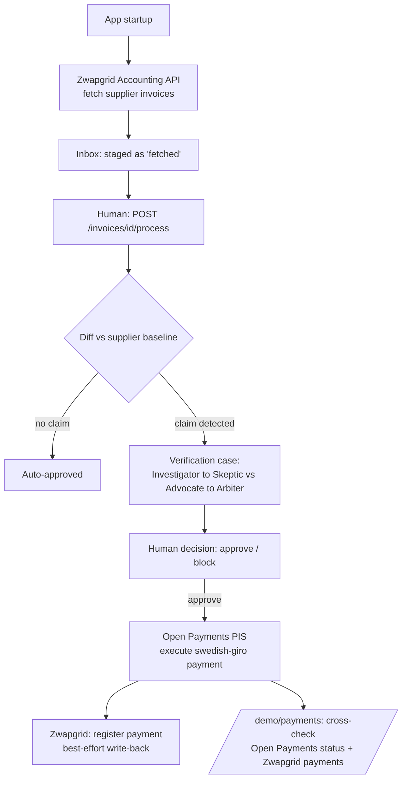

# Awesome Hackathon Project

## Real flow: Zwapgrid → Trust Layer → Open Payments

On startup (and on demand from the dashboard), the app pulls incoming supplier
invoices from **Zwapgrid's** real Accounting API and stages them in the inbox —
nothing runs automatically. A human then triggers processing per invoice: it's
diffed against the supplier's payment baseline, and either auto-approved (no
claim) or sent through the adversarial agent pipeline. Only after a human
approves the verdict does the app call **Open Payments Europe's** PIS sandbox
to actually execute the giro payment, then best-effort writes the payment back
into Zwapgrid/Fortnox. Status is later cross-checked against both systems
independently.

